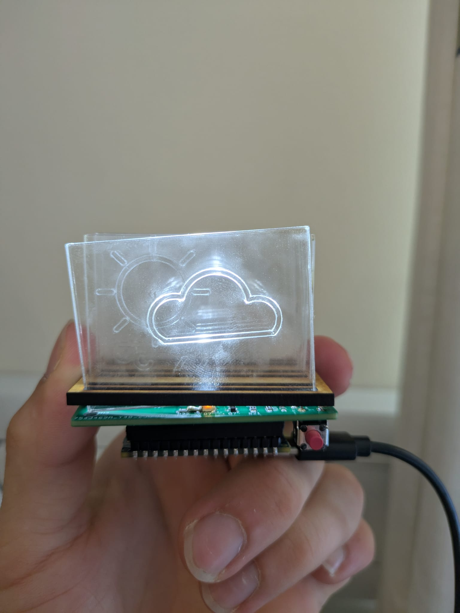
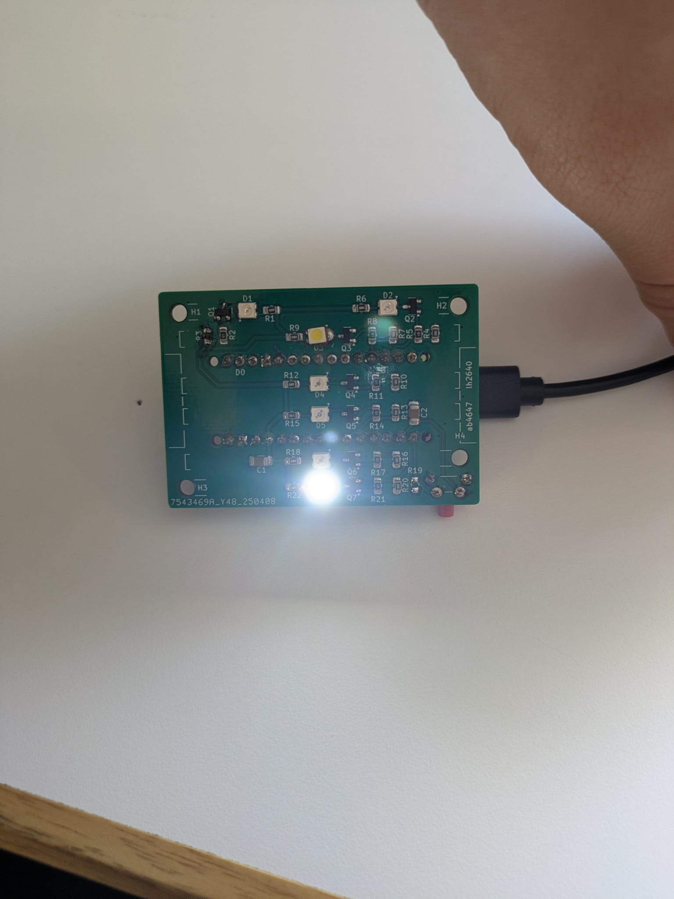

# Modular Side-Illuminated Display

A compact weather display system that lights up etched acrylic icons based on real-time weather data.  
Built with an **ESP32**, **custom PCB**, and **laser-cut acrylic panels**.

## Overview

- Fetches live weather data using the **OpenWeatherMap API**  
- Displays conditions via **side-illuminated acrylic panels**  
- Designed in **KiCad** and **assembled with laser-cut framing**  
- Modular design for expansion or icon swapping  

## Repository Structure

- `arduino_code/` — ESP32 firmware and test sketches  
- `images/` — project visuals and PCB renders  
- `Technical_Report_PW4.pdf` — detailed design report  
- `Risk_assessment_PW4.pdf` — safety and testing documentation  
- `README.md` — project summary  

## Key Files (images/)

- `drawings.jpg` — mechanical and wiring overview  
- `pcb_weather.png` — full PCB layout  
- `pcb_weather_front.png` — PCB front render  
- `pcb_weather_back.png` — PCB back render  
- `demonstration.jpg` — assembled front view  
- `demonstration_back.jpg` — rear view during operation  

---

## Demonstration

**Front View**  

**Back View**  

## How to Run

1. Open any `.ino` file in `arduino_code/` using **Arduino IDE**  
2. Install `WiFi`, `HTTPClient`, and `ArduinoJson` libraries  
3. Add your **Wi-Fi credentials** and **API key** in `weatherApiTest.ino`  
4. Upload to ESP32 and power on to display live weather conditions  

## Credits

Developed during **University of Bath Project Week 4**  
Contributors: ab4647, lh2640, ss5250, sjk81
