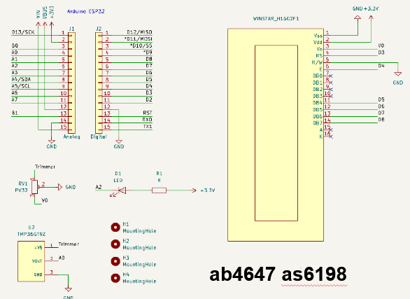
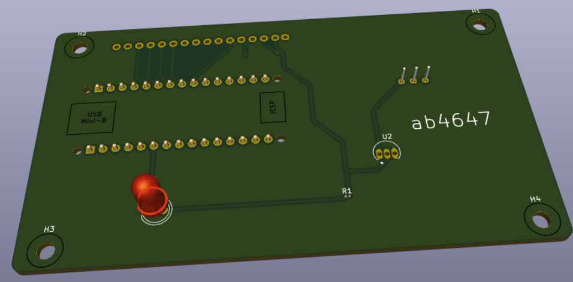
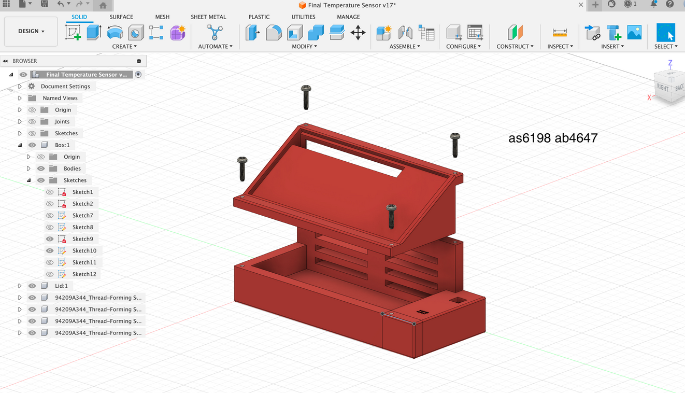
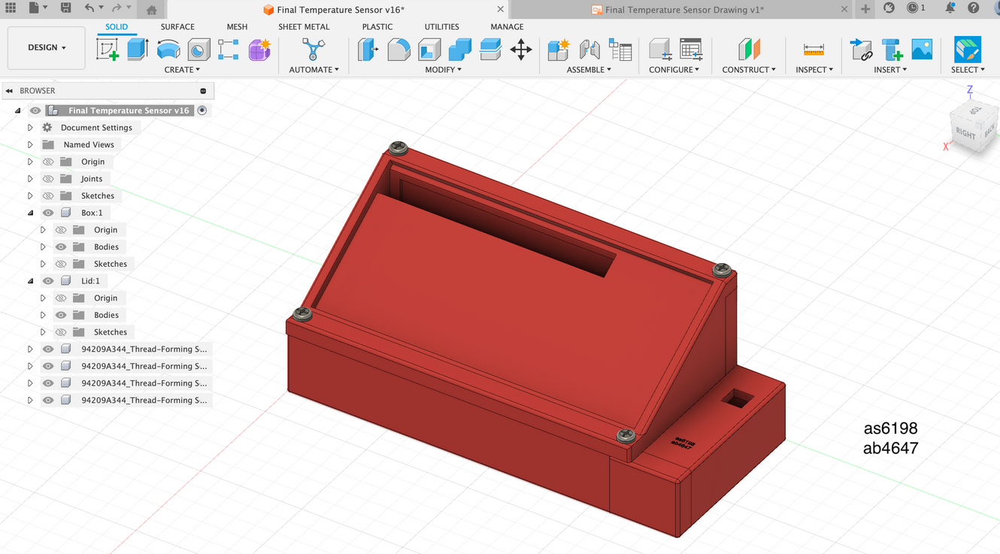

# Embedded Temperature Sensor with LCD Display

An Arduino-based embedded system that measures ambient temperature using a TMP36 sensor,  
displays readings on a 16x2 LCD, and activates an LED when the temperature exceeds a set threshold.

## Overview

- **Microcontroller:** ESP32 (3.3V logic)
- **Sensor:** TMP36 analog temperature sensor
- **Display:** Winstar H1602F 16x2 LCD
- **Indicator:** LED ON above 20°C
- **Interface:** I²C and analog input
- **Software:** Arduino (C++)

## Features

- Real-time temperature display on LCD  
- Adjustable contrast using a trimmer  
- LED alert system above configurable threshold  
- Compact PCB and laser-cut enclosure design  
- Tested against a commercial temperature sensor for validation  

## Repository Structure

- `Datasheet_LCD_System.pdf` — full documentation and source code  
- `Technical_Report_Temp.pdf` — system design and analysis  
- `Final Temperature Sensor Drawing v2.pdf` — mechanical drawings  
- `images/` — visuals and CAD outputs  
  - `schematic_embedded_temp.png` — system schematic  
  - `pcb_3D.png` — PCB 3D render  
  - `exploded_case_view.png` — exploded CAD view  
  - `assembled_case_view.png` — final assembled system  

## Demonstration

**System Schematic**  

**3D PCB View**  

**Exploded Enclosure**  

**Assembled Unit**  

## How to Use

1. Connect the TMP36 sensor, LCD, and LED according to the schematic.  
2. Open the Arduino sketch from the datasheet in **Arduino IDE**.  
3. Upload to the ESP32 and power via USB (3.3V logic).  
4. Adjust the trimmer for LCD contrast.  
5. Observe live temperature readings and LED activation above 20°C.  

## Credits

Developed during **University of Bath Project Week**  
Contributors: ab4647, as6198  
