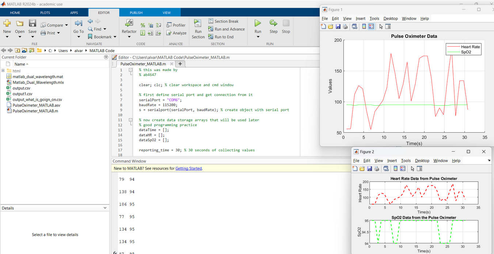

# Pulse Oximeter (Arduino + MATLAB)

A simple system that measures heart rate (HR) and blood oxygen saturation (SpO₂) using the MAX30100 sensor.  
Data is sent from the Arduino to MATLAB for live plotting and analysis.

## Overview

- **Arduino:** Reads MAX30100 sensor values and sends HR & SpO₂ via serial.  
- **MATLAB:** Receives serial data and plots it live using `animatedline`.  
- **Dataset:** Includes a sensor datasheet and recorded outputs for testing.

## Repository Contents

- `PulseOximeter_MATLAB.m` — MATLAB script for live plotting  
- `Datasheet_Pulse_Oximeter.pdf` — reference sensor datasheet  
- `images/` — visual results and graphs  
  - `matlab_demonstration.png`  
- `README.md`

## Usage

1. Upload Arduino code to your board (MAX30100 connected via I²C).  
2. Update COM port in `PulseOximeter_MATLAB.m`.  
3. Run the MATLAB script to view real-time HR and SpO₂ graphs.

## Example Output

